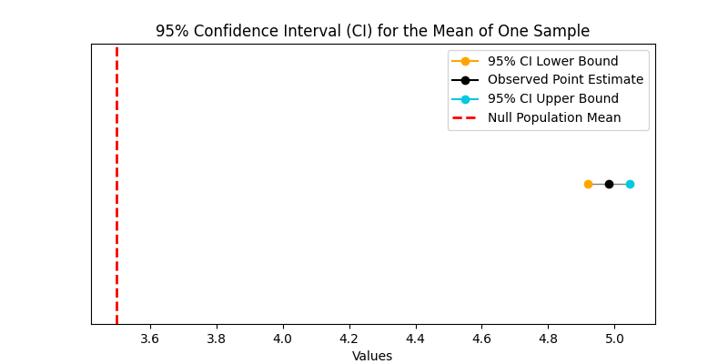

# Description

<span style="color: #00BFC4;">**A package to run hypothesis testing for one and two samples.**</span>

<br>

## One Sample Hypothesis Testing


```python
from hypothesis_testing_tool.compute_stats.one_sample_statistics import OneSampleTest
```

<br>

<span style="color: #00BFC4;">**Let's see an example of how you can use the `OneSampleTest` class.**</span>


```python
data = [1, 2, 5, 8, 10]
null_population_mean = 3.5

t_test = OneSampleTest(
        data = [1, 2, 5, 8, 10],
        null_population_mean = 3.5
        ).t_test_results

print(f"p-value: {t_test.pvalue:.2f}")
print(f"t-statistic: {t_test.statistic:.2f}")
```

    p-value: 0.38
    t-statistic: 0.99


<br>

<span style="color: #00BFC4;">**The default is with alternative = "two-sided", but that can change to a one tail test.**</span>


```python
t_test_less = OneSampleTest(
        data = [1, 2, 5, 8, 10],
        null_population_mean = 3.5,
        alternative = "less"
        )

t_test_greater = OneSampleTest(
        data = [1, 2, 5, 8, 10],
        null_population_mean = 3.5,
        alternative = "greater"
        )
```

<br>

<span style="color: #00BFC4;">**You can also compute the confidence interval (default = 95%) for the mean, using the `calculate_ci` method.**</span>

<span style="color: #00BFC4;">**The `calculate_ci` method takes an optional argument `alpha` to adjust to 99% CI (alpha = 0.01) or any other.**</span>


```python
confidence_interval = OneSampleTest(
        data = [1, 2, 5, 8, 10],
        null_population_mean = 3.5
        ).calculate_ci()
confidence_interval
```


    {'lower_bound': 0.43938833539220123,
     'point_estimate': 5.2,
     'upper_bound': 9.9606116646078,
     'null_population_mean': 3.5}


<br>

<span style="color: #00BFC4;">**Finally, you can create a plot with the CI and save it to a local path.**</span>


```python
from hypothesis_testing_tool.presentation.create_plots import create_one_sample_hypothesis_plot

```


```python
ci_dict = OneSampleTest(
                data = [1, 2, 5, 8, 10],
                null_population_mean = 3.5
        ).calculate_ci()

ci_plot = create_one_sample_hypothesis_plot("artifacts/one_sample_plot.png", ci_dict)
```



**In the plot above the 95% confidence interval includes 3.5, so we do not reject the null hypothesis.**
